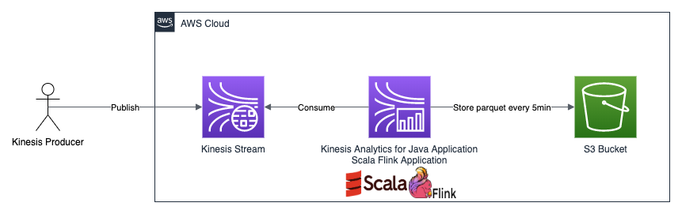

## Kinesis Analytics for Java Application (scala Flink) job
Simple example scala Flink job consuming protobuf data from Kinesis Stream and storing it on s3 using partitioned parquet.
This application is designed for deployment on [Kinesis Analytics for Java Applications](https://docs.aws.amazon.com/kinesisanalytics/latest/java/what-is.html).


### Pre-requirements
#### Required tools
* terraform
* aws cli
* sbt 1.3.5
* java 1.8
* maven > 3.1

### Usage
#### Required local dependency
Because of licence issues the Flink Kinesis Streams connector artifact isn't publicly available (see [Flink documentation](https://ci.apache.org/projects/flink/flink-docs-stable/dev/connectors/kinesis.html)). 
Therefore it must be build locally.

First get the Flink 1.8.2 [sources](https://github.com/apache/flink/releases/tag/release-1.8.2) from github.
Then build it with kinesis. 
```
mvn clean install -Pinclude-kinesis -DskipTests
```
 
#### Build
```
sbt assembly
```

#### Spin up infrastructure
```
cd infrastructure
terraform init
terraform apply
```

#### Deploy Kinesis Analytics Flink Application
Example deployment via aws cli
```
./create_application.sh
```

#### Publish test data
Run [KinesisProducerApp](src/test/scala/de/bdoepf/KinesisProducerApp.scala).
Now check the bucket for the parquet data. About every five minutes a new file should be created. 

#### Update Kinesis Analytics Flink Application
For updating the application code following script can be used
```
./update_request.sh
```

#### Tear down
```
./delete_request.sh
# Clean s3 bucket before destroying all resources. S3-buckets can't be deleted if there is still any data
terraform destroy
```
